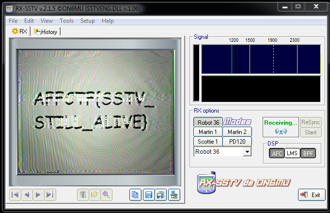

# UFO Sounds

## Misc - Points: 200

> S.E.T.I program captured strange message from outer space.
>
> 
>
>  
>
> [ufo_sounds.m4a](ufo_sounds.m4a)
>

Using the satellite audio signal as input for RX-SSTV gives the flag.

flag: `AFFCTF{SSTV_STILL_ALIVE}`