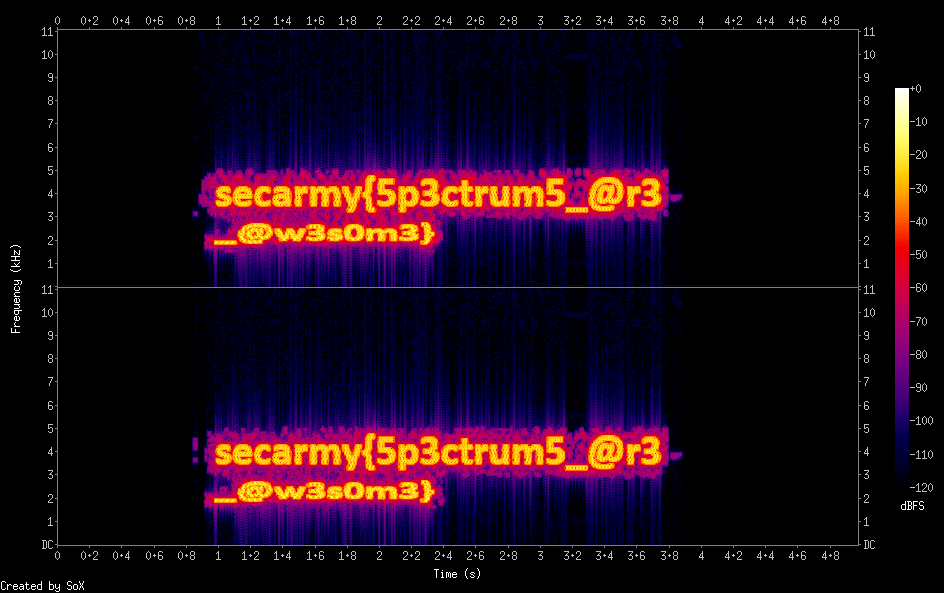

# Look Inside

## Misc - Points: 100

> Have you looked inside?
>
> 
>
> Author: z0m31en7
>
> [Look_inside.wav](Look_inside.wav)
>

Create spectrogram of the wav file and it reveals the flag in the image.

	$ sox Look_inside.wav -n spectrogram -o spectrogram.png

flag: `secarmy{5p3ctrum5_@r3_@w3s0m3}`