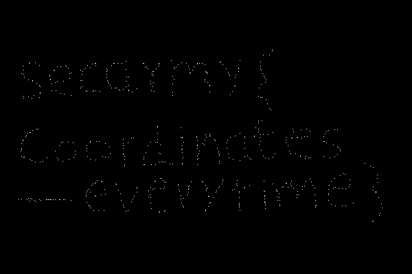

# Poor prisoner

## Misc - Points: 550

> I was playing with my SDR, I saw that someone is trying to communicate through radio, He was captured by some terrorists and needed my help, he told me that he has the flag for this challenge....and gave me these numbers!? Help me get my flag, he risked his life for same, don't disappoint him :) Note- The flag is all lowercase  Author: z0m31en7
>
> [radio_capture.txt](radio_capture.txt)
>

Drawing the coordinates as pixel values on an image reveals the flag.

flag: `secarmy{coordinates-everytime}`