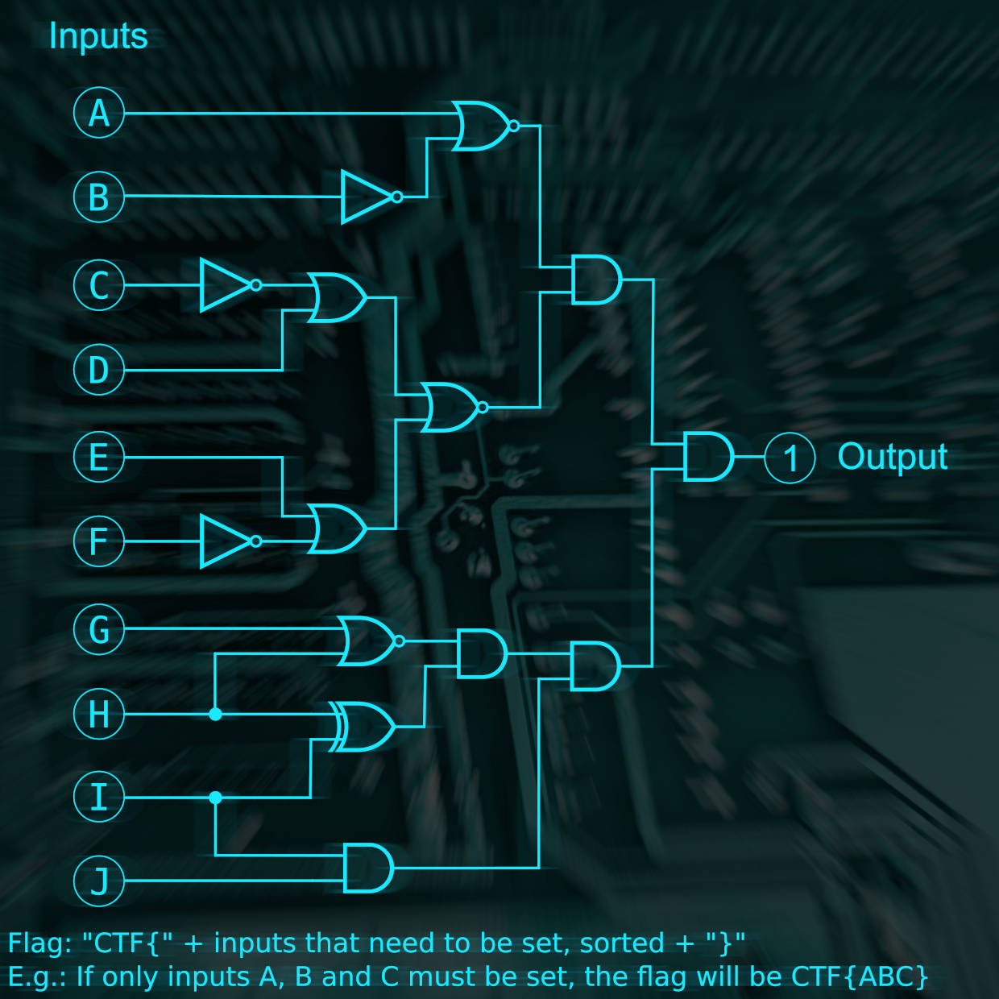

[../](../../)

# Moscow - Apartment

> It’s a cold day, and the snow is falling horizontally. It pierces your sight. You better use those extra pairs of socks that you were strangely given by the driver. Someone is waving on the other side of the street. You walk over to her. "Hi AGENT, I’m AGENT X, we’ve found the apartment of a person that we suspect got something to do with the mission. Come along!."

## Challenge: Logic Lock (misc)

> It turned out suspect's appartment has an electronic lock. After analyzing the PCB and looking up the chips you come to the conclusion that it's just a set of logic gates!

> https://storage.googleapis.com/gctf-2021-attachments-project/419bcccb21e0773e1a7db7ddcb4d557c7d19b5a76cd421851d9e20ab451702b252de11e90d14c3992f14bb4c5b330ea5368f8c52eb1e4c8f82f153aea6566d56

## Solution

flag: `CTF{BCFIJ}`

> Well, it’s a rather gloomy and messy apartment, a faint shade is cast from the almost covered master window upon the worn wall. It smells very burnt, and there's a cracked bottle in the sink that suggests some kind of experiment. Someone must have left in a hurry. Thinking about it, do you want to: Look at the beautiful view of the Kremlin from the window or search the apartment thoroughly

> Look at the beautiful view of Kreml, from the window (3): Wow look at the Kremlin. Ah, the Moscow Kremlin is really something else! But hey wait... look at the street, someone just started to run when he saw you in the window. Could it be the person that we’re looking for? You exit the building and see that they are jumping on a motorcycle and they take off! You spot a parked car, hotwire it and quickly take up the chase.

> Search it thoroughly (4): AGENT X seems to have missed that a plank on the floorboard has become very loose. You have a look and you see some kind of device under it. If you’re lucky, some information on it might come in handy. You have to travel back to the base if you wish to find out more.