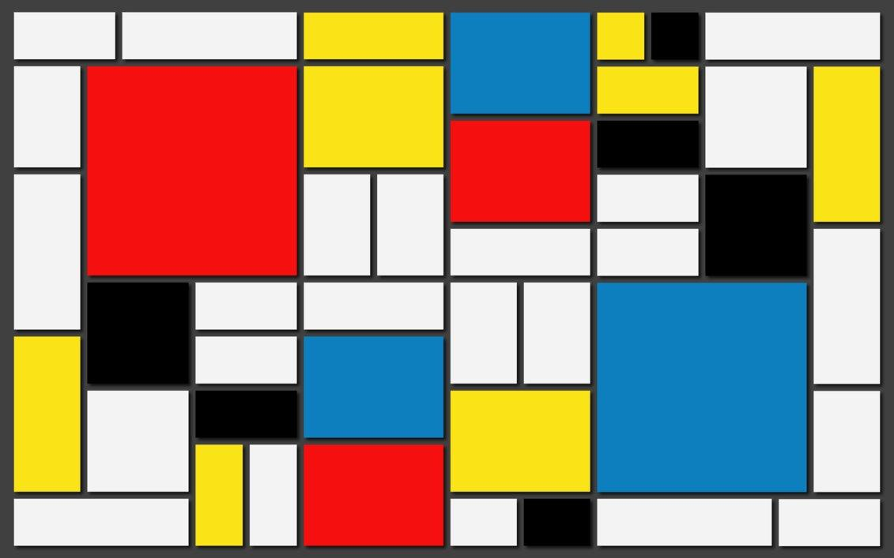

[../](../)

# Shenzhen - Office

> You’re exiting a crowded subway nearby the office that you are about to visit. You are showing the guards your ID and answering a couple of routine questions. They are not impressed, but the gate opens up and you can enter the area despite their doubt. You are not allowed to stroll freely on the company grounds, but are shown around by a woman that stares at you with a crooked smile. At last you're able to talk to the manager, a short man with a white robe and shades: "Greetings, AGENT, You must be thirsty after your long journey? No? You don’t mind if I’ll have something for myself, do you? Good! We have heard about the device that you possess, can I have a look at it. Hmm, it seems that it is encrypted. Help me break this quickly so that we can continue with the analysis."

## Challenge: To the moon (misc)

> This one is a doozie. We found this weird file on a memory stick with a post-it note on it. It looks like someone was working on a very obscure encryption system. Maybe we can decode it?

> https://storage.googleapis.com/gctf-2021-attachments-project/306a5e3c0faa213b4b3348366938020f90d38a41ae136a46547553fb3d6961c4bf598da6378092b4afd60f60a2510898c59d1a091961f0729c4839b1a6266a8f

## Solution

The challenge is to decode a file that has been encoded with some strange encodings.

The `encodings.txt` contains the following hints:

```
I made a super secret encoder. I remember using:
- a weird base, much higher than base64
- a language named after a painter
- a language that is the opposite of good
- a language that looks like a rainbow cat
- a language that is too vulgar to write here
- a language that ended in 'ary' but I don't remember the full name

I also use gzip and zlib (to compress the stuff) and I like hiding things in files...
```

The first encoding is base 65536, which means that the first hint applies. The following code uses [base65536](https://github.com/Parkayun/base65536) and writes the resulting hex string in a file.

```python
import base65536

with open("chall.txt") as file:
    decoded = base65536.decode(file.read())
    with open("image.jpeg", "wb") as out:
        for i in range(0, len(decoded), 2):
            out.write(int(decoded[i:i+2], 16).to_bytes(1, byteorder='big'))
```

The output file is the following JPEG image file.



What is visible on the image itself is not important, but the artist name in the image metadata contains strange data starting with `zaeeaeeuewawawe`.
The data is encoded with the [evil](https://esolangs.org/wiki/evil) esolang, which means that the third hint applies. It can be decoded with [evil](https://github.com/bacomatic/evil) and the result is again a hex string which has to be converted to a binary file.

The resulting data is zlib compressed and can be decompressed with the following python code.

```python
import zlib

with open("data", "rb") as file:
    data = file.read()
    decoded = zlib.decompress(data)
    with open("decompressed.gz", "wb") as out:
        out.write(decoded)
```

Decoding results in gzip compressed data and can be decompressed by executing `$ gunzip decompressed.gz` and results the following image.


The image is encoded with the [piet](https://esolangs.org/wiki/Piet) esolang and the second hint applies.
It can be decoded with [npiet](http://www.bertnase.de/npiet/npiet-1.3f.c), resulting in a hex string that must be converted to a binary file.

The resulting data must be decompressed with zlib again, resulting in a text file containing lines of the pattern `nyyyyyyyyyyyyyyyyyyyyyyyyyyyyyyyyyyyyyyyyyyyyyyyyya~`
The data was encoded with the [nya~](https://esolangs.org/wiki/Nya~) esolang and the forth hint applies.

After decoding you receive a large number, encoded with [Unary](https://esolangs.org/wiki/Unary) (last hint) which translates to brainf**k (fifth hint).
The number first needs to be converted to binary and the result can be translated with the following script.

```python
val = "1110011111000110011111001010010010010010010110000010010010010010010010010010010001011111000010010010010010010010100001010110000010010010010010010010010010010001011111000010010010010010010010100001010110000011011011011011011011011011011001011111000011011011011100001010010010010010110000010010010010010010010010010010001011111000010010010100001010110000011011011011011011011011011011001011111000011100001110000011011011011011011011011011011001011111000011011011011100001010010010010010110000011011011011011011011011011011001011111000011011011011011011011100001110000010010010010010010010010010010001011111000010100001010010010010010010110000010010010010010010010010010010001011111000010010010100001010010010010010010110000011011011011011011011011011011001011111000011011011011100001010010010010110000010010010010010010010010010010001011111000010010010010100001010110000010010010010010010010010010010001011111000010010010010010100001010010010010010010110000011011011011011011011011011011001011111000011011100001010010010010110000010010010010010010010010010010001011111000010010010010010010010100001010110000010010010010010010010010010010001011111000010010010010100001010010010010010010110000011011011011011011011011011011001011111000011100001110000010010010010010010010010010010001011111000010010010010100001010010010010010010110000010010010010010010010010010010001011111000010010100001010110000010010010010010010010010010010001011111000010100001"

mapping = {"000": ">", "001": "<", "010": "+", "011": "-", "100": ".", "101": ",", "110": "[", "111": "]"}
text = ""
for i in range(1, len(val), 3):
    text += mapping[val[i:i+3]]

print(text)
```

The resulting brainf**k code needs to be interpreted and finally prints the flag.

```
[-]>[-]<++++++[>++++++++++<-]>+++++++.<+[>++++++++++<-]>+++++++.<+[>----------<-]>----.<+++++[>++++++++++<-]>+++.<+[>----------<-]>-.<[>----------<-]>----.<+++++[>----------<-]>-------.<[>++++++++++<-]>+.<++++++[>++++++++++<-]>+++.<++++++[>----------<-]>----.<++++[>++++++++++<-]>++++.<+[>++++++++++<-]>+++++.<++++++[>----------<-]>--.<++++[>++++++++++<-]>+++++++.<+[>++++++++++<-]>++++.<++++++[>----------<-]>-.<[>++++++++++<-]>++++.<++++++[>++++++++++<-]>++.<+[>++++++++++<-]>+.<
```

flag: `CTF{pl34s3_n0_m04r}`

> "Great job! Let’s look into the device itself then. Well, I can’t say that I recognise this piece of hardware-" Before the manager completes the sentence, you spot a reflection of a dagger in his shades. You turn around and see a mysterious assassin that is almost piercing you with the dagger, but you manage to move away at the last moment and disarm the assassin with one strike. The mysterious assassin takes off. Do you?

> Run after (8): The manager shouts after you to come back, but you don’t listen. You are uncompromisingly determined to hunt down the assassin. The assassin turns over trash bins and chairs through the corridor, and you manage to dodge them. The assassin climbs up using a ladder, you follow. You come to a rooftop, and the assassin has nowhere to flee. You shout: "Reveal yourself, tell me who you’re working for, and I will do you no harm."The assassin comes out from behind a ventilation exhaust. They hand you a note with coordinates to a spot in the mediterranean. When you look again, the assassin is gone.

> Climb out through the window, and try to ambush the assassin (9): After having climbed through the window, you wait for a while on the ground. The guards from earlier approach you, and tell you that the mysterious assassin disappeared in the other direction, you will never see the assassin again… The manager screams on you to come back, and says that he thinks that he can help you a bit. He tells you that he has managed to trace some components of the device to a specific shipment from South Africa. He tells you that there is a secret lair in Johannesburg that might help you to find out more information about the organisation that the assassin works for.