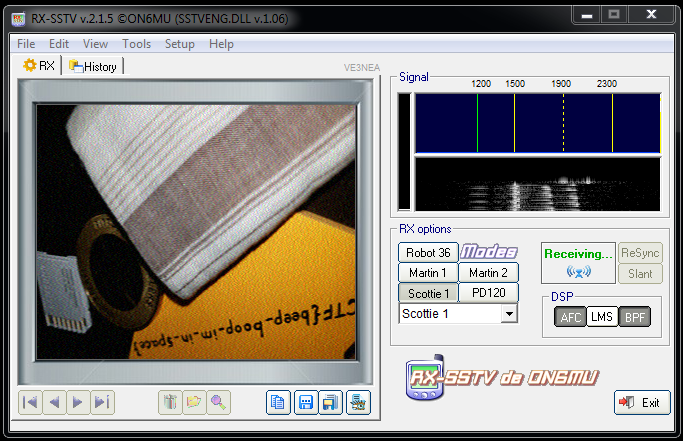

# m00nwalk

## Forensics - Points: 250

> Decode this message from the moon.
>
> [message.wav](https://2019shell1.picoctf.com/static/3b74fad79b1e7c60616c34aebc6268ee/message.wav)

Passing the satellite audio signal to `RX-SSTV` gives the flag.

flag: `picoCTF{beep_boop_im_in_space}`