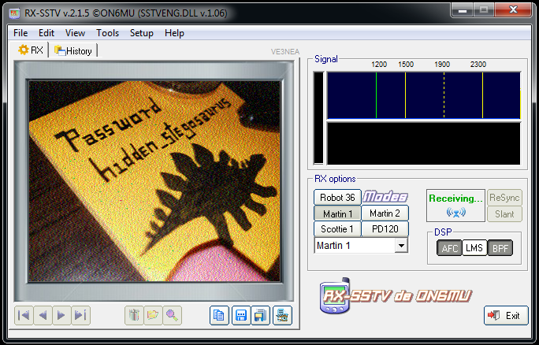
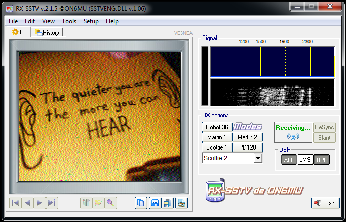

# m00nwalk2

## Forensics - Points: 300

> Revisit the last transmission. We think this transmission contains a hidden message. There are also some clues clue 1, clue 2, clue 3.
>
> [message.wav](https://2019shell1.picoctf.com/static/d3d387556119e53eaa63061402f5479e/message.wav)
>
> [clue1.wav](https://2019shell1.picoctf.com/static/d3d387556119e53eaa63061402f5479e/clue1.wav)
>
> [clue2.wav](https://2019shell1.picoctf.com/static/d3d387556119e53eaa63061402f5479e/clue2.wav)
>
> [clue3.wav](https://2019shell1.picoctf.com/static/d3d387556119e53eaa63061402f5479e/clue3.wav)

RX-SSTV output for `clue1.wav`:

RX-SSTV output for `clue2.wav`:

In the `message.wav` seems to be another flag embedded, lets try to extract it with `steghide` and the given password:

    $ steghide extract -sf message.wav -p hidden_stegosaurus -xf flag.txt

flag: `picoCTF{the_answer_lies_hidden_in_plain_sight}`