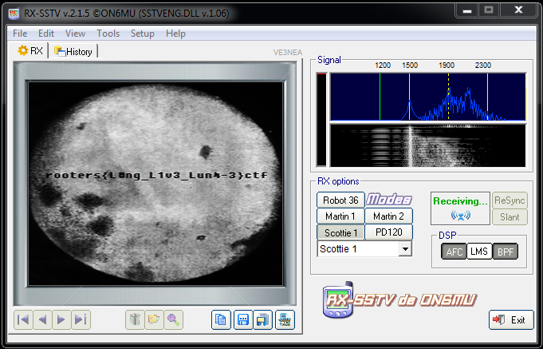

# Luna - 3

## Misc - Points: 485

> ## **Luna - 3**
>
> 
>
> > Luna - 3 is sending some images of the far side of the moon
>
> we need to show the world the unseen part of the moon help
>
> us retrieve the images.
>
> 
>
> **Author**
>
> 
>
> &nbsp;&nbsp;&nbsp;&nbsp;&nbsp;&nbsp;&nbsp;&nbsp;X3eRo0
>
> [recv_13.10.1959.wav](recv_13.10.1959.wav)
>

Using the satellite audio signal as input for RX-SSTV gives the flag.

flag: `rooters{L0ng_L1v3_Lun4-3}ctf`